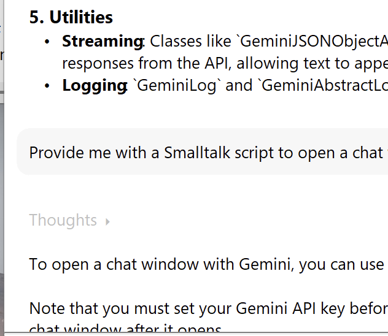

# VAST Platform AI Assistant

This repository contains tools that support AI Assisted development in the [VAST platform](https://www.instantiations.com/vast-platform/) development environment. Currently, there is support for Gemini AI.

## Gemini AI Assistant

Gemini AI Assistant adds [Google's Gemini AI](https://ai.google.dev/) to the VAST Platform: use natural language to ask questions about the entire VAST code base and let Gemini assist you in the development of VAST systems.

### Quick Start

#### Prerequisites

- [VAST Platform](https://www.instantiations.com/vast-platform/) version 14.1 or later.
- OpenSSL libraries installed and [configured in VAST](https://www.instantiations.com/vast-support/documentation/FAQ/index.html#page/FAQ/va09002.html).
- A Google Gemini API key, obtainable via [Google AI studio](https://aistudio.google.com/api-keys).

#### Get started

- Clone this repository.
- In VAST, **install the Tonel tools feature**. From the Transcript window, you can use the `Tools>>Load/Unload Features` menu item to load the `ST: Tonel Support` feature. We need [Tonel](https://www.instantiations.com/vast-support/documentation/1410/#page/sg/tonel/tnl01-index.519.01.html) to import the source code from this github repository into your local Envy library.
- From the Configuration Maps Browser, use the `Names>>Import>>Load Configuration Maps from Tonel Repository` menu item and point to the root directory of the local clone of the VAST Platform AI Assistant repository (which you cloned in the first step).
- In the window that opens, add only the config map for the `Gemini AI Assistant` that corresponds to your version of VAST (e.g. `Gemini AI Assistant (VAST 14.1.0)`) to the list of config maps to import and load.
- Once loaded, open `Gemini AI Assistant` from the Transcript window's `Tools` menu and fill-in your Gemini API key via the `Options>>Set API Key...` menu of the Gemini AI Assistant window.
- In an enterprise environment, you can set the proxy via `Options>>Set Proxy URL...`, e.g. proxy.mycorp.com:8080.
- You are ready to start asking questions to Gemini!

### Features Overview

The Gemini AI Assistant allows you to interact with Google Gemini AI models directly from your VAST platform IDE. The AI model is connected to your development image and has access to all source code through [Gemini functions](https://ai.google.dev/gemini-api/docs/function-calling). In addition, you can supply additional information to the model by adding files to the conversation. This can be useful to, for example, share stack dumps with Gemini when trying to analyze the origin of walkbacks.

#### Chat

Interact with Gemini AI by typing in the bottom pane of the Gemini AI Assistant window and hit the 'send' button. Gemini will write it's response in the top pane of the window and markdown will be rendered into user-friendly readable text.

When you use a model with thinking support, it is possible to display the thoughts by expanding the line that mentions 'Thoughts'.

#### Code

When Gemini's response includes Smalltalk source code, it is displayed with a vertical grey bar on the left. Click the grey bar to open the code in a Workspace. If the code contains a method definition of an existing method, a differences browser is opened to highlight the changes Gemini proposes to the current source code.

Further integration with development tools to improve coding assistance by Gemini is underway.

#### Tools

Gemini AI Assistant has access to a set of tools designed to help navigate, understand, and write code within the VAST Platform Smalltalk environment. If you want to know which ones these are, just ask Gemini "Can you list your tools?".

#### Files

Add files to the conversation via the toolbar menu and reference these in your conversation with Gemini.

#### Options

The Options menu allows to choose the version of the Gemini model that Gemini Chat uses.

### Contributing

We encourage contributions!
Please check the guidelines in the [CONTRIBUTING](CONTRIBUTING.md) file.

### License

The source code is distributed under the Apache 2.0 license.
See the [LICENSE](LICENSE) file for details.
