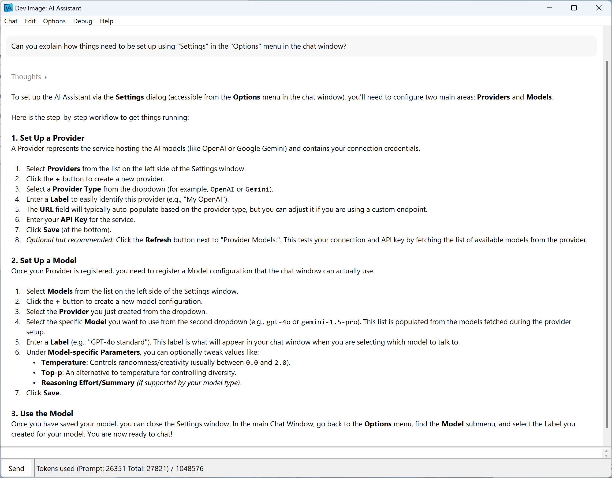
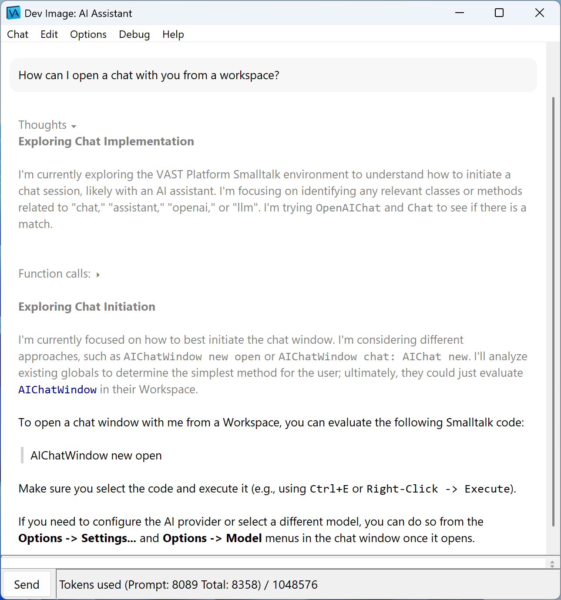
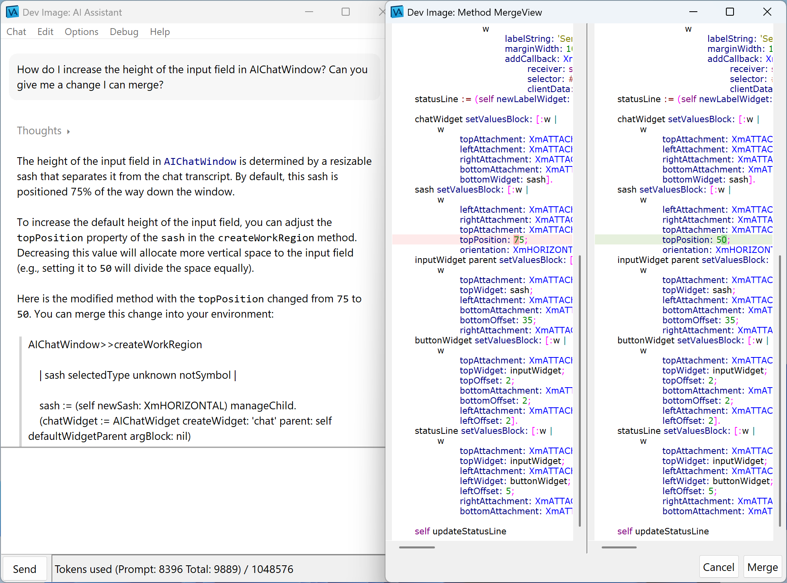
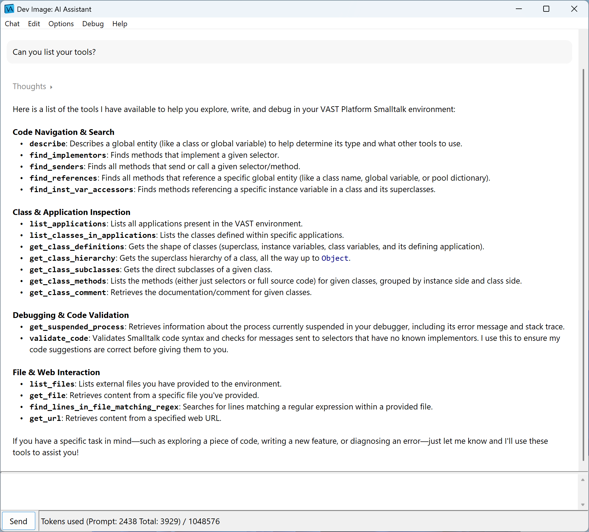
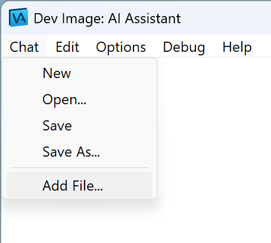

# VAST Platform AI Assistant

This repository contains tools that support AI Assisted development in the [VAST platform](https://www.instantiations.com/vast-platform/) development environment. Use natural language to ask questions about the VAST code base and let the AI assist you in the development of VAST systems.

### Supported Model Providers

The VAST Platform AI Assistant can be used with different Large Language Models (LLMs). It primarily supports use of [Google’s Gemini models](https://deepmind.google/models/gemini/). Preliminary support is available for using other models through any API compatible with the OpenAI Responses API as offered for example by [Ollama](https://ollama.com), [LMStudio](https://lmstudio.ai) and [LiteLLM](https://www.litellm.ai). Note that not all models may work, [Ollama models](https://ollama.com/search?c=tools) and [LMStudio models](https://lmstudio.ai/models?filter=tools) need to be able to use tools, thinking or reasoning capability on the other hand is recommended but not required.

<p align="center">

</p>

### Quick Start

#### Prerequisites

* [VAST Platform](https://www.instantiations.com/vast-platform/) version 14.1 or later.
* OpenSSL libraries installed and [configured in VAST](https://www.instantiations.com/vast-support/documentation/FAQ/index.html#page/FAQ/va09002.html).

#### Install and Load

* Clone, or [download a ZIP archive](https://github.com/instantiations/VAST-Platform-AI-Assistant/archive/refs/heads/main.zip) of, this repository.
* In VAST, load [Tonel](https://www.instantiations.com/vast-support/documentation/1410/#page/sg/tonel/tnl01-index.519.01.html) support: from the System Transcript window, use the menu item *Tools › Load/Unload Features* and load the ‘ST: Tonel Support’ feature.
* From the Configuration Maps Browser, use the menu item *Names › Import › Load Configuration Maps from Tonel Repository* and select the root directory of the local clone or extracted archive of the repository.
* In the window that opens, add and load the config map for the AI Assistant that corresponds to your version of VAST, either ‘VAST AI Assistant (VAST 14.1)’ or ‘VAST AI Assistant (VAST 15.0)’.
* Once loaded, open *AI Assistant* from the System Transcript window’s *Tools* menu. Follow the next section to add your configuration.

#### Configure

* From the AI Assistant window’s menu, select *Options › Settings*. This opens the settings window showing the configured providers and models. To use the AI Assistant, at least one provider and a model must be configured.
* Select ‘Providers’ and either add an API key for Gemini, or press ‘+’ and add the connection details for your preferred Responses API provider. A Gemini API key can be obtained through [Google AI Studio](https://aistudio.google.com/api-keys).
* Select ‘Models’ and add the models you want to use to the list. The available models for each provider will be shown automatically.
* If multiple models are configured, you can select which to use in the AI Assistant’s *Options › Model* menu.
* You are ready to start asking questions!

#### Configuring a Proxy (optional)

* If you need to use an HTTP proxy, evaluate the following in a workspace with the correct URL for the proxy to set it in the global configuration for the ‘httpsl’ transport. See the class SstHttpConfiguration for methods for setting credentials for the proxy or a list of excepted domains, and the [section on ‘Configuring an HTTP Client to Use a Proxy’](https://www.instantiations.com/vast-support/documentation/1500/ss/sst89s.html) in the documentation for further details.

  ```smalltalk
  (SstTransport configurationForIdentifier: 'httpsl')
  	proxyUrl: 'https://proxy.local:8080' sstAsUrl
  ```

### Features Overview

The AI Assistant allows you to interact with multiple AI models directly from your VAST platform IDE. The AI model is connected to your development image and has access to all source code. In addition, you can supply additional information to the model by adding files to the conversation. This can be useful to, for example, share stack dumps with the AI when trying to analyze the origin of walkbacks.

#### Chat

Interact with the AI by typing in the bottom pane of the AI Assistant window and hit the ‘Send’ button. The AI will write its response in the top pane of the window, with Markdown rendered into user-friendly readable text.

When you use a model with thinking support, it is possible to display the thoughts by expanding the line that mentions ‘Thoughts’:

<p align="center">

</p>

#### Code

When the response includes Smalltalk source code, it is displayed with a vertical grey bar on the left. Clicking the grey bar will open an appropriate tool - for proposed changes to classes or methods, a merge tool, otherwise a Workspace.

<p align="center">

</p>

#### Tools

The AI Assistant has access to a set of tools designed to help navigate, understand, and write code within the VAST Platform Smalltalk environment. If you want to know which ones these are, just ask for a list of the tools:

<p align="center">

</p>

#### Files

Add files to the conversation via the toolbar menu and reference these in your conversation:

<p align="center">

</p>

### Contributing

We encourage contributions! Please check the guidelines in the [CONTRIBUTING](CONTRIBUTING.md) file.

### License

The source code is distributed under the Apache 2.0 license. See the [LICENSE](LICENSE) file for details.
