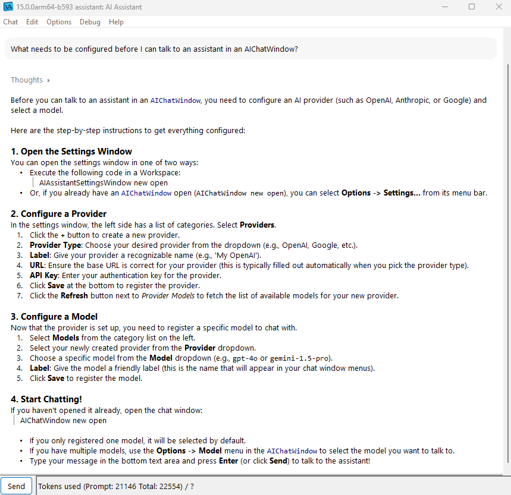
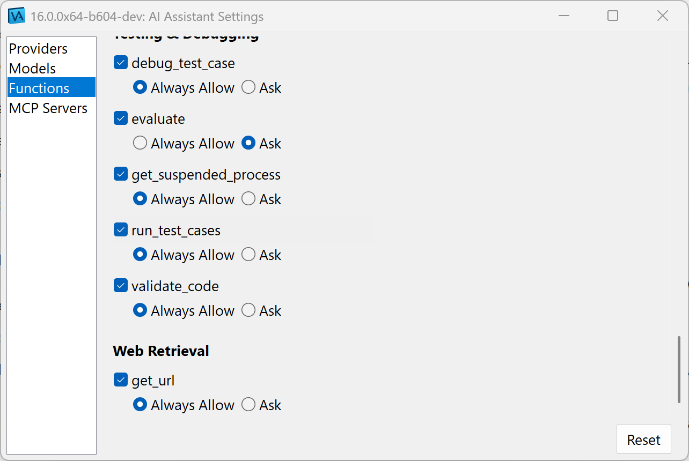
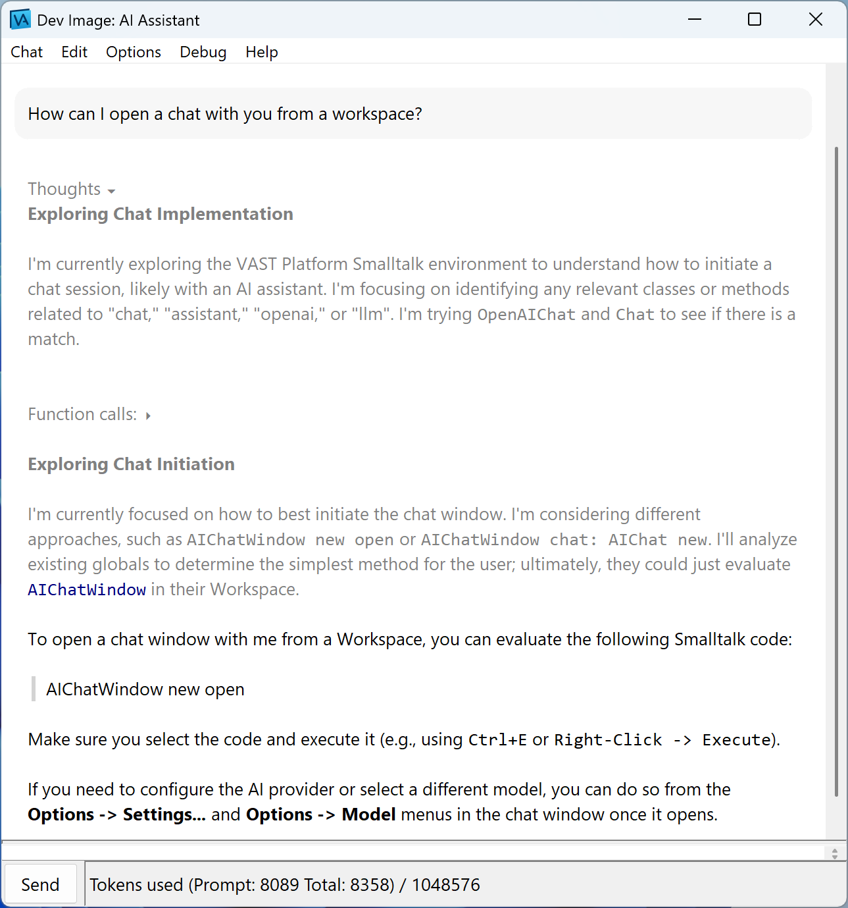
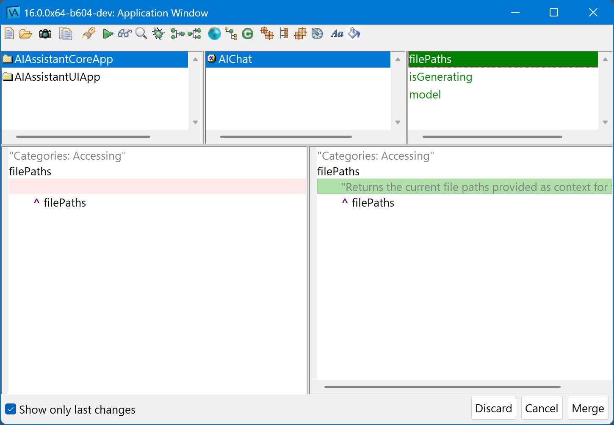
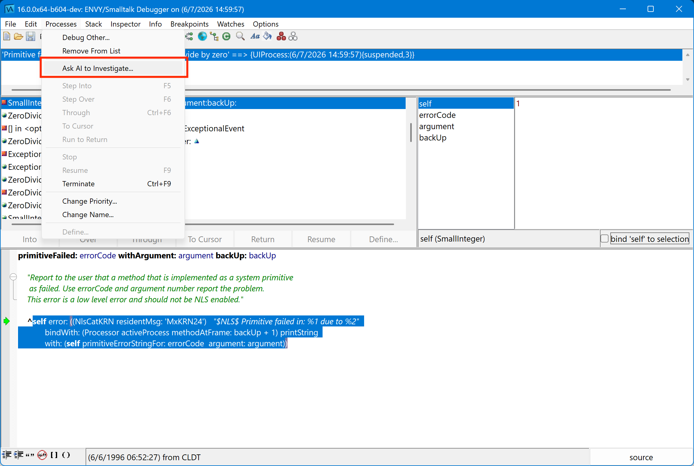
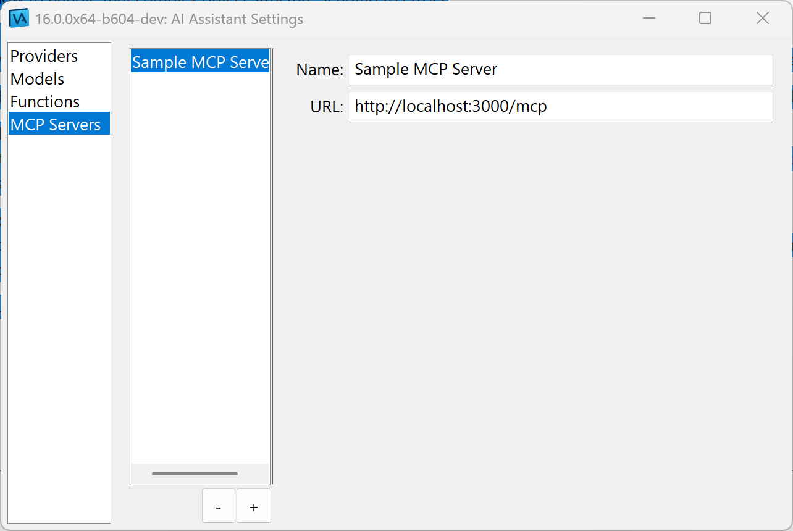
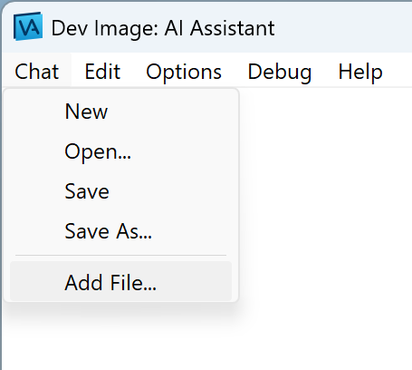

# VAST Platform AI Assistant

This repository provides the integration tools for AI-assisted development within the [VAST platform](https://www.instantiations.com/vast-platform/) development environment. It enables developers to use natural language to query codebases, analyze runtime errors, run tests, and automate development tasks directly from the IDE.

## Supported Model Providers

The VAST Platform AI Assistant can be used with different Large Language Models (LLMs). It supports [Google’s Gemini models](https://deepmind.google/models/gemini/) as well as other models through any API compatible with the OpenAI Responses API, as offered for example by [Ollama](https://ollama.com), [LMStudio](https://lmstudio.ai), and [LiteLLM](https://www.litellm.ai). Note that not all models may work: models (such as those from [Ollama](https://ollama.com/search?c=tools) or [LMStudio](https://lmstudio.ai/models?filter=tools)) need to support tool calling, while thinking or reasoning capability is recommended but not required.

<p align="center">

</p>

## Quick Start

### Prerequisites

* [VAST Platform](https://www.instantiations.com/vast-platform/) version 14.1 or 15.0.
* OpenSSL libraries installed and [configured in VAST](https://www.instantiations.com/vast-support/documentation/FAQ/index.html#page/FAQ/va09002.html).

### Install and Load

#### First time installation

* Clone, or [download a ZIP archive](https://github.com/instantiations/VAST-Platform-AI-Assistant/archive/refs/heads/main.zip) of, this repository.
* In VAST, load [Tonel](https://www.instantiations.com/vast-support/documentation/1410/#page/sg/tonel/tnl01-index.519.01.html) support: from the System Transcript window, use the menu item *Tools › Load/Unload Features* and load the ‘ST: Tonel Support’ feature.
* From the Configuration Maps Browser, use the menu item *Names › Import › Load Configuration Maps from Tonel Repository* and select the root directory of the local clone or extracted archive of the repository.
* In the window that opens, add and load the config map for the AI Assistant that corresponds to your version of VAST, either `VAST AI Assistant (VAST 14.1)` or `VAST AI Assistant (VAST 15.0)`.
* Once loaded, open *AI Assistant* from the System Transcript window’s *Tools* menu. Follow the next section to add your configuration.

#### Previous versions installed or in your ENVY Library

Due to a reorganization of applications and classes, some components cannot be loaded using the default settings through the UI menu.

You can load the configuration map by following these steps:

1. Unload the `VAST AI Assistant (VAST 15.0)` or `VAST AI Assistant (VAST 14.1)` configuration map from the Configuration Maps Browser.
2. Load the configuration map by evaluating the following script in Workspace:

```smalltalk
| loader |
loader := TonelLoader readFromPath: (CfsPath named: 'Z:\Common\Development\Repositories\VAST-Platform-AI-Assistant').
loader doNotUseBaseEditions; useSpecifiedVersion: '1.3.0'.
loader loadConfigurationMapNamed: 'VAST AI Assistant (VAST 15.0)' "or VAST AI Assistant (VAST 14.1)"
```

### Configure

* From the AI Assistant window, select **Options › Settings** to open the configuration panel. Note that at least one provider and one model must be configured to use the assistant.
* Under **Providers**, select your provider and enter its API key. If your preferred provider is not listed, click **+** to add its connection details (e.g., for local LLMs or custom OpenAI-compatible gateways).
* Under **Models**, add the models you wish to use. The assistant will automatically populate the available options for each active provider.
* Under **MCP Servers**, connect external Model Context Protocol (MCP) servers to dynamically extend the assistant's capabilities with custom tools.
* Under **Functions**, define the security policies (`Allow`, `Disallow`, or `Ask`) for executing sensitive tools on your system.
* If multiple models are configured, you can switch between them at any time via the **Options › Model** menu in the main window.
* You are now ready to begin collaborating with the assistant to analyze code, generate implementations, and automate your VAST development workflow.

<p align="center">

</p>

#### Configuring a Proxy (optional)

* If you need to use an HTTP proxy, evaluate the following in a workspace with the correct URL for the proxy to set it in the global configuration for the ‘httpsl’ transport. See the class SstHttpConfiguration for methods for setting credentials for the proxy or a list of excepted domains, and the [section on ‘Configuring an HTTP Client to Use a Proxy’](https://www.instantiations.com/vast-support/documentation/1500/ss/sst89s.html) in the documentation for further details.

  ```smalltalk
  (SstTransport configurationForIdentifier: 'httpsl')
  	proxyUrl: 'https://proxy.local:8080' sstAsUrl
  ```

## Features Overview

The AI Assistant allows you to interact with multiple AI models directly from your VAST platform IDE. The AI model is connected to your development image and has access to all source code. In addition, you can supply additional information to the model by adding files to the conversation. This can be useful to, for example, share stack dumps with the AI when trying to analyze the origin of walkbacks.

### Chat & Sessions

Interact with the AI by typing in the bottom pane of the AI Assistant window and hit the ‘Send’ button. The AI will write its response in the top pane of the window, with Markdown rendered into user-friendly readable text.

* **Thinking Support**: When you use a model with thinking/reasoning support, you can display the thoughts by expanding the line that mentions ‘Thoughts’. You can also configure settings like "Reasoning Effort" and "Reasoning Summary" for supported OpenAI models.
* **Sessions & Persistence**: Save your ongoing conversations to files and open them later to preserve your chat history.
* **Automatic Titles**: Chat windows now dynamically generate contextual titles in the background based on the conversation topic.
* **UI Interactivity**: Clickable chat widget elements like code blocks, function calls, and list items have interactive hover states and pointer indicators.

<p align="center">

</p>

### Code & Workspaces

* **Changes Browser**: When the assistant proposes code changes, a button is displayed at the end of the response. Clicking this button opens the Refactoring Changes Browser, allowing you to visually diff, review, and selectively apply the updates.
* **Workspaces**: When the response includes code, it is displayed with a vertical grey bar on the left. Clicking the grey bar on any code block opens a workspace with the language and syntax highlighting automatically configured to match the block's tag (e.g., Smalltalk, JSON, C).

<p align="center">

</p>

### Debugger Integration

You can analyze exceptions directly from the VAST Debugger. New "Ask AI to investigate" actions allow the AI Assistant to automatically inspect the suspended process stack frames to help you identify and debug the root cause of an issue.

<p align="center">

</p>

### Tools & Capabilities

The AI Assistant has access to a set of tools designed to help navigate, understand, and write code within the VAST Platform Smalltalk environment. If you want to know which ones these are, just ask for a list of the tools.

New and expanded capabilities include:
* **Test Execution & Debugging**: The AI can run specific SUnit test classes and debug failing test cases.
* **Version Control Analytics**: Query and compare Application and Configuration Map editions to analyze project history.
* **Regex File Search**: Find lines in user-provided files matching specific Regular Expressions.
* **Smalltalk Code Evaluation**: Evaluate arbitrary Smalltalk code expressions within the environment (when permitted).
* **Expanded Code Search**: Locate instance variable accessors and fetch historical method sources from previous editions.

### Code Modification Tools
*   **`add_class`**: Adds a new class to an application.
*   **`add_method`**: Adds a new method to a class.
*   **`change_class`**: Modifies an existing class definition (e.g., changing its instance variables).
*   **`change_method`**: Modifies the source code of an existing method.
*   **`remove_class`**: Removes a class from the environment.
*   **`remove_method`**: Removes a method from a class.

### Code Querying & Exploration Tools
*   **`describe`**: Describes a global entity (class, variable, pool dictionary) in the VAST environment.
*   **`find_implementors`**: Finds methods that implement a given selector.
*   **`find_inst_var_accessors`**: Finds methods referencing a specific instance variable within a class hierarchy.
*   **`find_references`**: Finds all methods that reference a given global entity (like a class or global variable).
*   **`find_senders`**: Finds all methods that send (call) a given message selector.
*   **`get_class_comment`**: Retrieves the comment of one or more classes.
*   **`get_class_definitions`**: Gets the shape of classes (superclass, variables, application).
*   **`get_class_hierarchy`**: Gets the superclass hierarchy of a class up to Object.
*   **`get_class_methods`**: Retrieves the methods (source code or just selectors) and categories for given classes.
*   **`get_class_subclasses`**: Gets the direct subclasses of given classes.
*   **`list_applications`**: Lists all applications present in the image.
*   **`list_classes_in_applications`**: Lists the classes defined within specific applications.

### Code Evaluation & Testing Tools
*   **`evaluate`**: Evaluates a Smalltalk expression and returns the print string of its result.
*   **`debug_test_case`**: Runs a single SUnit test case in debug mode and returns the stack trace if it fails or errors.
*   **`get_suspended_process`**: Gets information about the process currently suspended and selected in the debugger.
*   **`run_test_cases`**: Runs a list of SUnit test classes and returns the execution results (passed, failed, errors).
*   **`validate_code`**: Validates the syntax of VAST Smalltalk code and checks for unknown selectors.

### Version Control & Edition Tools
*   **`compare_application_editions`**: Compares two application editions and summarizes the differences.
*   **`compare_configuration_map_editions`**: Compares two configuration map editions and summarizes the differences.
*   **`get_application_editions`**: Lists the available editions/versions of an application.
*   **`get_configuration_map_editions`**: Lists the available editions/versions of a configuration map.
*   **`get_method_source_in_edition`**: Gets the source code of a specific method in a given past application edition.

### File & Web Integration Tools
*   **`list_files`**: Lists the context files provided to the assistant.
*   **`get_file`**: Retrieves the contents of a specific provided file.
*   **`find_lines_in_file_matching_regex`**: Finds lines matching a regex in a provided file.
*   **`get_url`**: Retrieves text content served at a specific URL.


## MCP Servers

The [Model Context Protocol (MCP)](https://modelcontextprotocol.io) is an open standard that enables developers to build secure, bidirectional connections between AI models and data sources or tools.

The VAST Platform AI Assistant supports connecting to external MCP servers using the Streamable HTTP transport protocol. By integrating external MCP servers, you can dynamically extend the assistant's capabilities with custom tools tailored to your environment, databases, APIs, or local services.

### Configuration

To register a new MCP server:

1. Open the AI Assistant settings window via **Options › Settings**.
2. Select **MCP Servers** in the sidebar.
3. Click the **`+`** button at the bottom of the server list to add a new server entry.
4. Enter the **Name** for the server (e.g., `Sample MCP Server`) and its **URL** (the MCP Streaming endpoint, e.g., `http://localhost:3000/mcp`).
5. Select **Functions** in the sidebar and press the **Reset** button, the assistant will establish a connection to the server, discover its functions and add them to the list of functions.

<p align="center">

</p>


## Files

Add files to the conversation via the toolbar menu and reference these in your conversation:

<p align="center">

</p>

## Contributing

We encourage contributions! Please check the guidelines in the [CONTRIBUTING](CONTRIBUTING.md) file.

## License

The source code is distributed under the Apache 2.0 license. See the [LICENSE](LICENSE) file for details.
